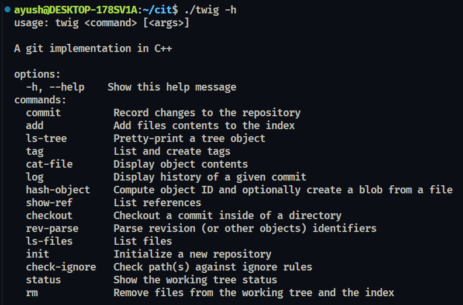

# Twig

<p align="center">
  
</p>


A minimal Git implementation in C++, built from scratch. Twig can initialize repositories, hash and compress objects, build an index, resolve references, and commit — enough to be self-hosting.



---

## Bootstrapping

One commit in this repository's history was made using Twig itself: [docs(readme): add 'Bootstrapping' section](https://github.com/journeycodesayush/twig/commit/1956dd2)

---

## Commands

| Command        | Description                                       |
| -------------- | ------------------------------------------------- |
| `init`         | Initialize a new repository                       |
| `hash-object`  | Compute object hash and optionally write to store |
| `cat-file`     | Print object contents                             |
| `log`          | Show commit history                               |
| `ls-tree`      | List tree object contents                         |
| `checkout`     | Restore working tree from a commit                |
| `show-ref`     | List references                                   |
| `tag`          | Create a tag                                      |
| `rev-parse`    | Resolve a revision to an object hash              |
| `ls-files`     | List files tracked in the index                   |
| `check-ignore` | Test whether a path is ignored                    |
| `status`       | Show working tree status                          |
| `rm`           | Remove a file from the index and working tree     |
| `add`          | Add a file to the index                           |
| `commit`       | Record changes to the repository                  |

---

## Build

Requires `g++`, `make`, `libssl-dev`, and `zlib1g-dev`.

```bash
git clone https://github.com/JourneyCodesAyush/Twig.git
cd twig
make
```

For a release build:

```bash
make release
```

---

## Usage

```bash
./twig init
./twig add src/main.cpp
./twig status
./twig commit -m "feat(core): initial commit"
./twig log
```

---

## Project Structure

```
twig/
├── include/
│   ├── argparse/argparse.hpp
│   ├── commands/command.hpp
│   ├── errors/error.hpp
│   ├── ignore/ignore.hpp
│   ├── index/index.hpp
│   ├── objects/object.hpp
│   ├── repository/objects.hpp
│   └── utils/utils.hpp
├── src/
│   ├── commands/command.cpp
│   ├── ignore/ignore.cpp
│   ├── index/index.cpp
│   ├── objects/
│   │   ├── blob.cpp
│   │   ├── commit.cpp
│   │   ├── tag.cpp
│   │   └── tree.cpp
│   ├── repository/objects.cpp
│   ├── utils/
│   │   ├── hash.cpp
│   │   ├── deflate.cpp
│   │   ├── io.cpp
│   │   └── fnmatch.cpp
│   └── main.cpp
└── Makefile
```

---

## Dependencies

| Library                               | Purpose                                  |
| ------------------------------------- | ---------------------------------------- |
| OpenSSL (`libssl-dev`)                | SHA-1 hashing for object IDs             |
| zlib (`zlib1g-dev`)                   | deflate compression for object storage   |
| `<fnmatch.h>`                         | Pattern matching for `.gitignore`        |
| `<sys/stat.h>`, `st_ctim` / `st_mtim` | File metadata for index freshness checks |

The last two are POSIX APIs available on Linux and WSL. **Twig does not support macOS or Windows natively.**

---

## Known Limitations

- `add` accepts individual files only — directory expansion is not implemented.
- `add` does not check ignore rules.
- Linux and WSL only.
- Directory patterns in `.gitignore` (e.g. `makeBuild/`, `.vscode/`) are not matched correctly — files inside ignored directories are still shown as untracked by `status` and `check-ignore`.

---

## Contributing

Contributions are welcome. Please follow these guidelines:

- Fork the repository and create a branch: `feat/feature-name` or `fix/bug-name`
- Follow [Conventional Commits](https://www.conventionalcommits.org/en/v1.0.0/) for commit messages
- Open a pull request with a clear description of your changes

### Commit Scopes

| Scope        | Description                                   |
| ------------ | --------------------------------------------- |
| `cli`        | Entry point and argument parsing (`main.cpp`) |
| `commands`   | Command implementations                       |
| `object`     | Changes to blob, commit, tree, or tag         |
| `index`      | Index read/write logic                        |
| `ignore`     | Ignore rule parsing and matching              |
| `repository` | Repository and object store                   |
| `utils`      | Hashing, compression, IO, fnmatch             |
| `argparse`   | Argument parser header                        |
| `error`      | Error codes and exception wrapper             |
| `docs`       | Documentation changes                         |
| `build`      | Makefile changes                              |

---

## License

MIT - See [LICENSE](LICENSE)
